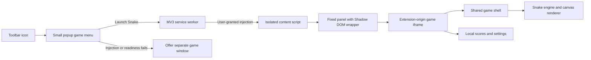

# GameHub implementation plan

Prepared: 2026-10-07, Asia/Kolkata. Working name: GameHub. Phases 1–3 implemented 2026-10-07; actual layout and deviations are in `docs/HANDOFF.md` and `docs/DECISIONS.md`.

## 1. Outcome

Build a Chrome extension that provides a small menu from its toolbar icon. Selecting Snake opens a movable, non-modal game panel on the current website. The player can return to the website at any time; Snake pauses and keeps its current run in memory while the panel remains mounted. Future games use the same launcher and panel.

This document is the build plan, not a statement that the extension already works.

## 2. Requirements and defaults

### Requested by the user

- Toolbar click opens a little game menu.
- Selecting a game opens a dialog-like game window over the website.
- Keep ordinary website operations available.
- Start with Snake; support additional games later.
- Generate the first game's assets before implementation.
- Keep project context and agent handoff in Markdown inside this project.

### Proposed defaults

- Dark, compact arcade UI with green Snake pieces and coral food.
- One movable panel per tab, initially near the upper-right corner with a 16px viewport margin.
- Pause on focus loss, tab hiding, minimize, or switching games; no automatic resume.
- Local high score and settings, no account, backend, analytics, or network dependency.
- Sound off by default; optional short synthesized sounds need no downloaded audio assets.
- Full page reload/navigation ends the current run. Reopen the extension to launch again. A minimized panel preserves its run in the current document.
- On pages that prohibit overlays, explain the limitation and offer an explicit separate-window button.

These defaults are editable choices, not user-confirmed requirements.

## 3. Browser constraints

| Constraint | Planned response | Evidence |
| --- | --- | --- |
| A toolbar popup closes when focus leaves it | Use it only for selecting a game; gameplay has an independent lifetime | [Chrome popup documentation](https://developer.chrome.com/docs/extensions/develop/ui/add-popup) |
| Browser-owned pages such as `chrome://` do not grant injection access | Catch the actual injection failure; show a fallback action | [Chrome activeTab documentation](https://developer.chrome.com/docs/extensions/develop/concepts/activeTab) |
| A configured action popup does not fire `action.onClicked` | Launch from the popup's own button/message handler | [Chrome action API](https://developer.chrome.com/docs/extensions/reference/api/action) |
| Script injection requires scripting plus page access | Use user-invoked `activeTab` access and `scripting`, top frame only | [Chrome scripting API](https://developer.chrome.com/docs/extensions/reference/api/scripting) |
| A web page cannot embed a private extension document | Make only the embedded game entry page web-accessible to HTTP(S) origins | [Chrome web-accessible resources](https://developer.chrome.com/docs/extensions/reference/manifest/web-accessible-resources) |
| Manifest icons cannot be SVG or WebP | Use the supplied PNG icon exports | [Chrome icon documentation](https://developer.chrome.com/docs/extensions/reference/manifest/icons) |
| MV3 restricts remote executable code | Ship all game logic and dependencies in the extension package | [Chrome remote-code guidance](https://developer.chrome.com/docs/extensions/develop/migrate/remote-hosted-code) |

Also include Chrome Web Store pages, the built-in PDF viewer, another extension's pages, new-tab variants, file URLs without access, and strict site CSPs in manual compatibility testing. Treat injection and iframe readiness results as authoritative; do not assume a URL regex captures every restriction. A fallback window is an ordinary Chrome window, without a promised OS-level always-on-top setting. A site can place its own top-layer UI above an injected panel or remove the host element; the panel is not immune to hostile pages.

## 4. Architecture

Use plain JavaScript ES modules, CSS, HTML, and Canvas 2D. A framework and a game engine add little value for the first game. Development tests can use Node's built-in runner. Build tooling can be added if a concrete packaging requirement appears.



### Launcher and worker

1. The popup reads the local game registry and renders one Snake entry.
2. The user selects Snake. Resolve the active tab at click time and send a launch request to the worker.
3. The worker validates the game ID, injects the bundled content loader into the top frame, and requests launch.
4. The content loader must be idempotent: repeated injection or repeated clicks reuse one panel and do not register duplicate listeners.
5. The game iframe sends a ready acknowledgment. Close the popup only after success, not immediately after `executeScript` resolves.
6. Use a bounded readiness timeout and a recoverable error if the iframe cannot load. The popup offers “Open in separate window”; no silent navigation of the user's tab.
7. Keep transient coordination outside worker-global assumptions. A suspended/restarted worker must still handle a launch; use `storage.session` for any session routing metadata needed across restarts.

### Panel wrapper and focus

- The host has only the panel's physical bounds. No full-page transparent element that could swallow input.
- Use a fixed-position wrapper with strong local style reset and Shadow DOM for panel chrome. The cross-origin iframe contains the game UI and keyboard handling.
- Drag using a designated header, pointer capture, and viewport clamping. Do not start a drag from a button or from the game board.
- Never write to the page's body overflow, margins, document title, form values, or application styles.
- The game handles keys only inside its own focused frame. Website events are not globally prevented.
- Frame blur and document visibility change pause the engine immediately. Returning focus displays Resume, without advancing missed ticks.
- Minimize hides the frame after pausing, leaving a small restore chip. Close disposes the engine, frame, host, listeners, timers, pointer capture, and observers.
- Escape while inside gameplay pauses; Escape again while paused closes. Tab can leave the non-modal panel. No modal focus trap or `showModal()`.
- Restore the previously focused website element on close only if it is still connected, valid, and the player has not already moved focus elsewhere.
- After navigation, no automatic reinjection or resume. A same-document SPA route may retain the mounted panel; full document navigation removes it.

The iframe's ready/blur behavior, host CSP compatibility, keyboard isolation, and popup-to-panel focus transfer are hypotheses to validate in a real Chrome prototype before building polished gameplay.

### Permissions and resource exposure

- Proposed permissions: `activeTab`, `scripting`, `storage`.
- Do not request persistent `host_permissions`, `tabs`, history, notifications, debugger, or network interception for this MVP.
- Expose only the iframe entry HTML needed for web embedding to `http://*/*` and `https://*/*`; assets and modules loaded within the extension page should remain private unless real testing proves a requirement.
- Keep the popup, worker, content script, Markdown, and tooling out of web-accessible resource lists. Do not use an asset-folder wildcard by habit.
- Use an allowlist for game IDs and message types. Validate runtime sender identity, tab/frame context, and payload types; a publicly embeddable game page must not become an arbitrary extension-API gateway.
- If parent/frame `postMessage` is needed for drag or shell state, validate `event.source` against the actual iframe and validate the expected extension origin. Session IDs are routing identifiers, not secrets hidden from the host page.
- Do not read the host page's content. Detect visibility/focus and manage only the extension's own elements.

## 5. Planned source layout

```text
extension/                         # future load-unpacked directory
  manifest.json
  background/service-worker.js
  popup/index.html
  popup/popup.js
  popup/popup.css
  content/overlay.js               # self-contained injection entry
  game/index.html                 # iframe and separate-window entry
  game/shell.js
  game/shell.css
  games/registry.js
  games/snake/engine.js
  games/snake/renderer.js
  games/snake/index.js
  shared/storage.js
  shared/messages.js
  assets/                         # copies of runtime assets only
tests/                            # future meaningful logic tests
assets/                           # master assets already prepared
scripts/                          # asset preparation tools
docs/                             # durable project memory
```

The future extension directory receives assets from the repository masters; do not load files from outside the unpacked extension root. `content/overlay.js` must be directly executable after injection rather than relying on unbundled static module imports.

## 6. Game extension point

Registry entries provide `{ id, title, description, cover, load }`. `load` must use an explicit bundled import map, not remote URLs or user-provided module paths. Only ship real playable entries; future games do not need fake selectable cards.

A game module provides `mount(container, services)` and returns `{ start, pause, resume, restart, destroy }`. The shell owns shared controls, blur/visibility behavior, settings, and score storage; the module owns its rules and renderer. `pause` and `destroy` are idempotent. Persist scores through a serialized worker write path so two tabs cannot accidentally lower the shared best score.

## 7. Snake specification

- A 20×20 logical board; scale the canvas to fit without changing the rules.
- Start length 3 at the center, facing east. Show Ready and a Start button; the snake must not move before the player starts. Selection opens this playable screen directly.
- Arrow keys and WASD turn. Space toggles pause/resume while the game has focus. Provide visible Start, Pause/Resume, Restart, and direction controls.
- Reject 180-degree reversals. Accept at most one pending turn per simulation tick to prevent two fast keys from reversing the snake between ticks.
- Movement begins at 140ms per cell; reduce by 5ms every 5 apples, with an 80ms minimum. Use a fixed-step accumulator, reset it on pause/resume, and avoid catch-up bursts after suspension.
- One apple at a time, spawned uniformly from the currently empty cells. Each apple adds 10 points and one segment.
- Wall and self collisions end the run. Moving into the current tail cell is legal when the tail vacates on a non-growing tick.
- When no empty cells remain, show a win state instead of retrying apple placement forever.
- Show current score and local best, plus Game over/Win and Play again. Restart clears pending input and timing state.
- Asset rotations and tile geometry are defined in `assets/README.md`; image artwork does not define collision bounds.

## 8. Implementation phases

| Phase | Work | Exit condition |
| --- | --- | --- |
| 0 — Assets and plan | Generate artwork; create editable pieces and controls; export Chrome icons; save local context | Assets inspected; inventory and handoff agree with disk |
| 1 — Browser prototype | MV3 manifest, launcher, worker, one iframe panel, close/minimize/drag, focus, fallback | Overlay survives popup close; page still works; restricted-page path explained; frame loading verified |
| 2 — Snake | Pure engine, renderer, ready/pause/game-over/win states, keyboard and button controls | Core rules and focus-based pause pass; assets render clearly |
| 3 — Persistence and extensibility | Best score, settings, lifecycle cleanup, registry contract, multi-tab handling | Repeated launches create one panel; pause/cleanup reliable; next game needs no host rewrite |
| 4 — Verification and packaging | Manual Chrome matrix, targeted engine tests, install instructions, runtime-only bundle | Acceptance criteria pass; no unverified success claims; documented unpacked build |

Implementation starts at phase 1 when the user asks to continue. Do not skip the prototype by building the entire game inside the toolbar popup.

## 9. Acceptance criteria

- Clicking the extension shows a small menu; choosing Snake opens exactly one panel on a supported page.
- The panel remains after the launcher closes; it can be moved, minimized, restored, and closed.
- Outside the panel, scrolling, clicking links, typing in fields, website shortcuts, video playback, and existing loading/network tasks continue normally.
- Website input cannot turn the snake; gameplay keys do not trigger the website's key handlers.
- Focus loss, hidden tab, and minimize pause without losing the mounted run; resume is explicit.
- Snake starts, turns, grows, scores, collides, restarts, and handles a full-board win correctly.
- Icons render clearly at actual toolbar sizes. Every referenced resource exists inside the extension package.
- Unsupported tabs show an understandable explanation and an explicit separate-window option.
- Repeat launch, close/reopen, extension reload, viewport resize, 80–200% browser zoom, and two tabs do not create duplicate loops or inaccessible controls.
- All executable code is packaged locally; the game works offline after installation.
- Another coding agent can continue from the repository's Markdown alone.

## 10. Deferred scope

Additional games, multiplayer, cloud scores, login, achievements, ads, automatic launch on every site, store publication graphics, and gameplay survival across full navigation. Chrome Web Store publication is a later task with its own listing and privacy review; the current asset set is for the Snake MVP, not a complete store listing.
