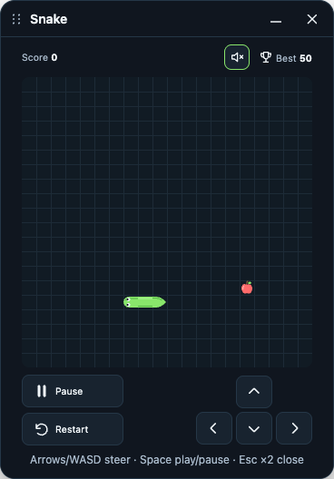

# GameHub

Play a quick game of Snake while a website loads, uploads, or processes. Click the GameHub icon, press **Play**, and a small game panel opens over the page — the website keeps working underneath.



## Download

**[⬇ Download GameHub-1.0.0.zip](https://github.com/Pallavrai/GameHub/releases/latest/download/GameHub-1.0.0.zip)** · [all releases](https://github.com/Pallavrai/GameHub/releases)

GameHub is not on the Chrome Web Store, so Chrome installs it in Developer mode (takes a minute).

## Install

1. Download and unzip `GameHub-1.0.0.zip`. Move the `GameHub-1.0.0` folder somewhere permanent — Chrome loads it from that folder, so don't delete it.
2. Open `chrome://extensions` in Chrome.
3. Turn on **Developer mode** (top-right switch).
4. Click **Load unpacked** and select the `GameHub-1.0.0` folder.
5. Click the puzzle-piece icon in the toolbar and pin **GameHub**.

Works in Chrome and other Chromium browsers (Edge, Brave, Arc) that support loading unpacked extensions.

## Play

1. Open any normal website.
2. Click the GameHub icon → **Play**.
3. Press **Start** (or Space).

| Key | Action |
| --- | --- |
| Arrow keys / W A S D | Steer |
| Space | Start, pause, resume |
| Esc | Pause; press again to close |

- Drag the panel by its header; **–** minimizes it to a small chip, **×** closes it.
- Clicking the website or switching tabs pauses the game automatically. Nothing resumes until you press Resume.
- Your best score is saved on your computer. Sound is off by default; use the speaker button to turn it on.

## Good to know

- **Some pages can't show the panel**: the new-tab page, `chrome://` pages, and the Chrome Web Store block extensions. GameHub offers **Open in separate window** there instead.
- **Reloading or leaving the page closes the game.** Open it again from the icon.
- **Updating**: download the new zip, replace the folder, then click the reload icon on GameHub's card in `chrome://extensions`.
- Chrome may show a "Developer mode extensions" notice on startup; that is normal for extensions installed this way.

## Privacy

GameHub has no account, ads, analytics, or network requests. It only touches a page when you click Play on it (`activeTab`), and it never reads the page's content. Permissions: `activeTab`, `scripting`, `storage`.

## For developers

```text
extension/        the extension Chrome loads (no build step)
tests/            engine tests and a Chrome end-to-end harness
scripts/          asset generators and the release packager
assets/           master artwork and sources
docs/             plan, decisions, design, verification records
```

```sh
node --test tests/*.test.mjs     # game rule tests
./scripts/package.sh             # builds dist/GameHub-<version>.zip
```

Start with [AGENTS.md](AGENTS.md), [PLAN.md](PLAN.md), and [docs/HANDOFF.md](docs/HANDOFF.md). Test evidence and known untested scenarios are in [docs/VERIFICATION.md](docs/VERIFICATION.md).

## License

No license is granted. You may download and use the extension; the source code is © Pallav Rai, all rights reserved.
